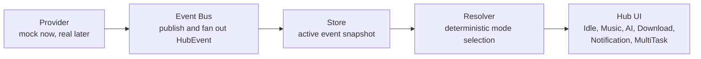

# Cober-Windows-Bar Architecture

This document describes the v0.5.3 architecture alignment for new contributors. v0.5.3 is documentation-only: the current runtime remains mock-only and does not include Tauri, Rust, IPC, Windows/system APIs, real providers, tray behavior, always-on-top desktop behavior, or v0.6 provider/runtime implementation.

## Product Shape

Cober-Windows-Bar is a Windows 11 Unified Status Hub. The application starts as a React showcase with deterministic mock events, then grows toward a desktop shell and real providers only after the event model is stable.

The planned architecture keeps every source of status data behind a provider boundary, normalizes provider output into hub events, resolves those events into one visible hub mode, and lets the UI render that resolved mode without knowing where the data came from.

## Planned Flow



Text form:

```text
Provider -> Event Bus -> Store -> Resolver -> UI
```

Current mock runtime:

```text
Mock Provider or Event Controls -> event path -> store/resolver -> existing Hub UI
```

Future real runtime:

```text
Real Provider -> Event Bus -> Store -> Resolver -> Hub UI
```

Provider registries and adapters may help with discovery, lifecycle, and integration, but they are auxiliary to the canonical path. They must not bypass the Event Bus, Store, or Resolver when changing hub UI state.

The future runtime is a design direction, not a v0.5.3 implementation commitment.

## HubEvent Contract

For v0.6 documentation, the canonical `HubEvent` top-level field set is:

```ts
interface HubEvent {
  id: string;
  type: "music" | "ai" | "download" | "notification" | "system" | "developer";
  source: string;
  createdAt: number;
  expiresAt?: number;
  progress?: number;
  payload?: Record<string, unknown>;
  metadata?: Record<string, unknown>;
}
```

Non-canonical top-level fields are deferred or payload-only: `kind`, event-level `status`, `title`, `subtitle`, `priority`, and `updatedAt`. In particular, task status belongs in `payload` unless a later contract promotes it.

## Layer Responsibilities

### Providers

Providers own data collection and translation from a domain source into hub events.

Current providers are mock-only. Future providers may represent music sessions, downloads, notifications, system status, developer tooling, or AI agent work, but those real integrations belong to later roadmap stages.

Provider responsibilities:

- Start and stop cleanly.
- Subscribe listeners to emitted events.
- Emit normalized `HubEvent` objects or batches.
- Avoid direct UI imports, state mutations, resolver logic, or desktop-shell assumptions.
- Treat provider-specific details as private implementation details.

Boundary:

- Providers do not decide the current hub mode.
- Providers do not render React components.
- Providers do not call Windows/system APIs in v0.5.3.

Provider lifecycle terms such as starting, running, stopping, or failed startup describe whether a provider process or integration is operating. They are separate from registry health and separate from event/task status in `payload`.

### Provider Registry

A Provider Registry may track provider discovery, registration, health, and availability in a later stage.

Boundary:

- Registry health or availability does not mean an emitted event is active, complete, failed, or cleared.
- Registry state does not decide the current hub mode.
- Registry paths must publish `HubEvent` objects through the Event Bus before hub UI state changes.
- The Registry does not bypass the Event Bus, Store, or Resolver.

### Event Bus

The Event Bus is the narrow transport layer for hub events.

Responsibilities:

- Accept published `HubEvent` objects.
- Notify subscribers in publication order.
- Keep provider adapters decoupled from store internals.
- Remain synchronous and deterministic unless a later stage proves a need for queueing.

Boundary:

- The Event Bus should not contain resolver priority rules.
- The Event Bus should not own long-lived hub state beyond subscriber management.
- The Event Bus should not know about React components.

### Store

The Store owns the current active event snapshot used by the resolver.

Responsibilities:

- Add, update, replace, expire, or clear events.
- Keep event records deterministic for tests and replay.
- Expose enough state for the resolver and showcase visualization.
- Preserve mock event behavior until real provider stages are approved.

Boundary:

- The Store should not fetch provider data.
- The Store should not render UI.
- The Store should not contain domain-specific provider code.
- The Store should not treat provider lifecycle or registry availability as event/task status.

### Resolver

The Resolver turns the Store snapshot into one visible hub mode.

Responsibilities:

- Apply deterministic priority rules.
- Resolve one primary mode for the compact hub.
- Return MultiTask when multiple meaningful events compete.
- Return Idle when no active event remains.
- Keep behavior stable enough for tests, screenshots, and contributor reasoning.

Boundary:

- The Resolver should not mutate provider state.
- The Resolver should not depend on timers except through event timestamps or store expiry.
- The Resolver should not import React components.
- The Resolver reads canonical event fields and approved payload semantics; it does not infer provider lifecycle or registry health as event/task status.

### UI

The UI renders the resolved hub mode and supporting showcase diagnostics.

Responsibilities:

- Render Idle, Music, AI Progress, Download, Notification, and MultiTask states.
- Display event playground controls and resolver visualization in showcase mode.
- Preserve the Windows 11 Fluent/Mica/Acrylic visual direction.
- Treat resolver output as view data, not as a place to recompute priority rules.

Boundary:

- UI components should not call providers directly.
- UI components should not implement system integrations.
- UI components should not decide cross-event priority.

## Contributor Rules

- Keep mock behavior deterministic until the architecture is ready for real providers.
- Add or change resolver behavior with tests because priority changes affect the whole hub.
- Keep provider contracts small; prefer adapters over provider-specific UI paths.
- Document future integrations as proposals unless the roadmap stage explicitly includes implementation.
- Keep provider lifecycle state, registry health/availability, and event/task status as separate concepts.
- Do not add Tauri, Rust, IPC, Windows/system APIs, real providers, tray behavior, or always-on-top behavior as part of v0.5.3 alignment.

## Current v0.5.3 Status

v0.5.3 aligns documentation before expanding runtime capability. The current app remains a React/Vite/Tailwind showcase with mock events and mock providers only.
