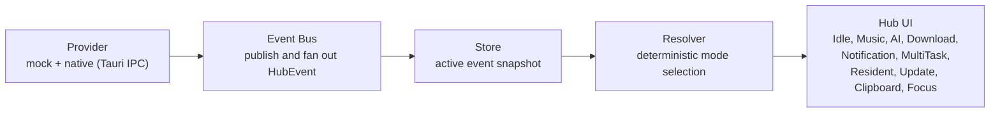

# Cober-Windows-Bar Architecture

This document describes the current architecture of Cober-Windows-Bar as of the Tauri integration (post-v0.7). The application runs as a Tauri 2 desktop app with real system data flowing through the runtime layer.

## Product Shape

Cober-Windows-Bar is a Windows 11 Unified Status Hub. It runs as a Tauri desktop application that displays a compact, Fluent Design-styled status bar in the lower-right corner of the screen. Real system data (CPU, memory, network, media playback) flows from the Rust backend through Tauri IPC into the React frontend, where it is normalized, resolved into a display mode, and rendered.

The architecture keeps every source of status data behind a provider boundary, normalizes provider output into hub events, resolves those events into one visible hub mode, and lets the UI render that resolved mode without knowing where the data came from.

## Data Flow



Text form:

```text
Provider -> Event Bus -> Store -> Resolver -> UI
```

### Runtime Paths

**Mock path** (dev/showcase without Tauri):

```text
Mock Provider / Event Controls -> Event Bus -> Store -> Resolver -> Hub UI
```

**Tauri path** (production desktop):

```text
Rust Backend (sysinfo/GSMTC/etc.)
  -> Tauri IPC (invoke / events)
  -> Runtime Adapter (tauriRuntime.ts, desktopStatusInputRuntime.ts)
  -> Event Bus -> Store -> Resolver -> Hub UI
```

The frontend runtime layer (`src/runtime/`) detects whether Tauri is available and automatically falls back to mock data when running outside the desktop shell (e.g., during web development with `npm run dev`).

## HubEvent Contract

The canonical `HubEvent` top-level field set:

```ts
type HubEventType =
  | "music"
  | "ai"
  | "download"
  | "notification"
  | "system"
  | "developer";

interface HubEvent {
  id: string;
  type: HubEventType;
  source: string;
  createdAt: number;
  expiresAt?: number;
  progress?: number;
  payload?: Record<string, unknown>;
  metadata?: Record<string, unknown>;
}
```

Non-canonical top-level fields remain deferred or payload-only: `kind`, event-level `status`, `title`, `subtitle`, `priority`, and `updatedAt`.

## Layer Responsibilities

### Providers

Providers own data collection and translation from a domain source into hub events. Two categories exist:

- **Mock providers** (`src/providers/mockProviders.ts`): Emit deterministic fake events for development and testing.
- **Native providers** (Rust backend via Tauri IPC): Real system data sources including system performance (sysinfo) and Windows Media Session (GSMTC).

Provider responsibilities:

- Start and stop cleanly.
- Subscribe listeners to emitted events.
- Emit normalized `HubEvent` objects or batches.
- Avoid direct UI imports, state mutations, resolver logic, or desktop-shell assumptions.
- Treat provider-specific details as private implementation details.

Boundary:

- Providers do not decide the current hub mode.
- Providers do not render React components.
- Native providers access system APIs only through the Rust/Tauri layer, never directly from TypeScript.

### Provider Registry

The Provider Registry (`src/providers/providerRegistry.ts`) tracks provider discovery, registration, health, and availability. It provides:

- `listCapabilitySupport()` — returns copied capability facts per provider.
- `summarizeCapabilitySupport()` — aggregates diagnostic capability support.

Boundary:

- Registry health or availability does not mean an emitted event is active, complete, failed, or cleared.
- Registry state does not decide the current hub mode.
- Registry paths must publish `HubEvent` objects through the Event Bus before hub UI state changes.

### Runtime Bridge Layer

The runtime bridge layer (`src/runtime/`) is the interface between the Tauri native backend and the frontend state system. Key modules:

- **`tauriRuntime.ts`** — Detects Tauri environment, wraps `invoke()` calls with timeout and error handling, provides graceful fallback to mock data. Reports diagnostic context for `fixtureEvents` and `runtimeCapabilities`.
- **`desktopStatusInputRuntime.ts`** — Three-tier source selection: mock → tauri-fixture → tauri-event push. Manages the polling loop (1800ms interval) for system performance and media session data.
- **`systemPerformanceRuntime.ts`** — Calls `get_system_performance` Tauri command, normalizes CPU/memory/network metrics, tracks source quality (live/fallback/stale/unavailable).
- **`desktopProductRuntime.ts`** — Listens for Tauri events: menu actions, settings changes, open-settings requests.
- **`statusWindowRuntime.ts`** — Window management: overlay state, floating policy enforcement, fullscreen avoidance, position correction, debounced display/scale change handling.

### Event Bus

The Event Bus is the narrow transport layer for hub events.

Responsibilities:

- Accept published `HubEvent` objects.
- Notify subscribers in publication order.
- Keep provider adapters decoupled from store internals.
- Remain synchronous and deterministic.
- Snapshot events at the transport boundary to prevent caller-side mutations.

### Store

The Store (`createHubStoreState` in `src/state/hubState.ts`) owns the active event snapshot used by the resolver.

Responsibilities:

- Add, update, replace, expire, or clear events.
- Keep event records deterministic for tests and replay.
- Expose active events to the resolver and showcase diagnostics.
- Return snapshots as copied read models (immutable to consumers).

### Resolver

The Resolver (`resolveDesktopStatusState` in `src/state/desktopStatusState.ts`) turns the Store snapshot into one visible hub mode.

Responsibilities:

- Apply deterministic priority rules.
- Resolve one primary mode for the compact hub.
- Return MultiTask when multiple meaningful events compete.
- Return Idle when no active event remains.
- Consider attention reasons (new, near-complete, completion, urgent).
- Respect preferred-kind windows and user interaction timing.

Priority order:

1. Notification (urgent interruption)
2. MultiTask (multiple active meaningful events)
3. AI Progress (long-running agent work)
4. Download (file transfer progress)
5. Music (ongoing media)
6. Resident (system performance when nothing else active)
7. Idle (no active events)

### UI Layer

The UI renders the resolved hub mode and supporting showcase diagnostics.

- **`DesktopPage.tsx`** — Main desktop view; orchestrates runtime polling, preference management, window drag, context menu, and settings panel.
- **Status Templates** — `ResidentStatusTemplate`, `MediaStatusTemplate`, `DownloadStatusTemplate`, `UpdateStatusTemplate`, `ClipboardStatusTemplate`, `FocusStatusTemplate`.
- **`DesktopStatusTransition`** — Animated transitions between status templates using Framer Motion.
- **`GuestSourceHealthIndicator`** — Shows data source quality (Live/Fallback/Stale/Unavailable).
- **Showcase components** — `ShowcasePage`, `EventPlaygroundPanel`, `ModeSidebar`, `StatusFlow`, `FluentStyleGuide` for development and QA.

Boundary:

- UI components do not call providers directly.
- UI components do not implement system integrations.
- UI components do not decide cross-event priority.

## Tauri Backend (Rust)

The Rust backend (`src-tauri/src/lib.rs`) provides:

- **System performance**: CPU usage (via `sysinfo`), memory usage, network throughput sampling.
- **Windows Media Session**: GSMTC API integration for real-time playback status, position, and duration.
- **Window management**: Position correction to monitor work areas, Z-order control (always-on-top), tool window style (hidden from taskbar).
- **Fullscreen detection**: Win32 API checks (`GetForegroundWindow`, `GetWindowRect`, `MonitorFromWindow`) with edge tolerance and desktop/Shell window exclusion.
- **System tray**: Tray icon with context menu (show/settings/quit), left-click toggle.
- **Global hotkey**: `Alt+Shift+Space` to recall/show the status window.
- **Preferences**: JSON file persistence for always-float, avoid-fullscreen, lock-position settings.
- **IPC commands**: `get_system_performance`, `get_runtime_capabilities`, `get_guest_provider_capabilities`, `get_media_session_status`, `get_hub_event_fixtures`, `emit_hub_event_fixtures`, `get_overlay_policy`, `set_status_window_floating`, `correct_status_window_position`, `start_window_drag`, `show_status_center_context_menu`, `get_status_center_settings`, `set_status_center_preferences`, `show_status_center_window`, `open_status_center_settings`, `quit_status_center`.

## Privacy Boundaries

System data collection follows strict privacy rules:

- Only coarse metrics are collected: CPU %, memory %, network throughput category.
- Media session exposes only playback status, position, and duration — not track metadata unless explicitly surfaced.
- No process lists, window titles, usernames, file paths, credentials, or hardware serials cross the IPC boundary.
- Diagnostic fields use bounded enums: `quality` (live/fallback/stale/unavailable), `code` (available/unsupported/permission-denied/etc.).

## Contributor Rules

- Keep mock behavior available for web-only development (`npm run dev` without Tauri).
- Add or change resolver behavior with tests because priority changes affect the whole hub.
- Keep provider contracts small; prefer adapters over provider-specific UI paths.
- New providers must implement the `HubProvider` interface and flow through the Event Bus.
- Native system data must flow through Tauri IPC commands, never direct browser API calls.
- Keep provider lifecycle state, registry health/availability, and event/task status as separate concepts.
- All system data collection must respect the privacy boundaries defined above.
